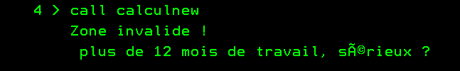
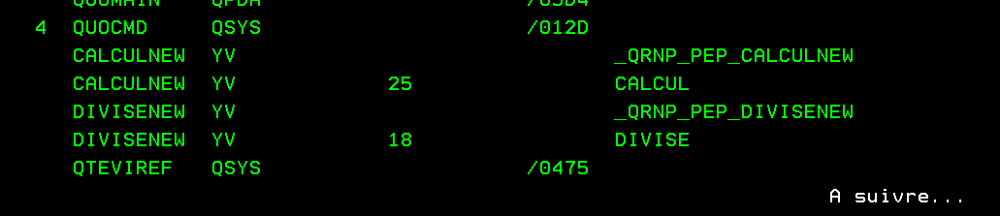
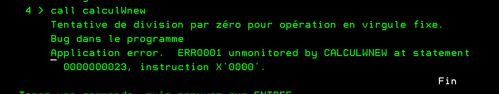

# Gestion des erreurs.

Comment profiter des nouvelles évolutions du langage RPG de la V7R5 pour mieux gérer nos erreurs.
- SND-MSG   pour envoyer un message depuis un rpg. (cf SNDMSG de CLP)
- ON-EXCP   pour capturer un message dans un programme (cf MONMSG de CLP)

## Différents cas. 
### On remonte l'escape !
```
    monitor;
        clear lMessage;
        getQuotient(lDividende:lDiviseur:lQuotient);
       lMessage =' le résultat est ' + %char(lQuotient);
    on-excp 'USR0001';
        lMessage = 'Le nombre de mois est obligatoire.';
    on-excp 'USR0002';
        // plus de 12 mois travaillés ==> jackpot :-) 
        lMessage =' plus de 12 mois de travail, sérieux ?';
    on-error;
        snd-msg *escape %msg('ERR0001':'YABUG':%trim(%proc())); 
    endmon;
    snd-msg lMessage;
```
  

### ok avec 14 pour dividende
 
  

### old calcul appelle new divise
Comment se comporte le programme appelant si pas de monitor ?
  

## Ressources
