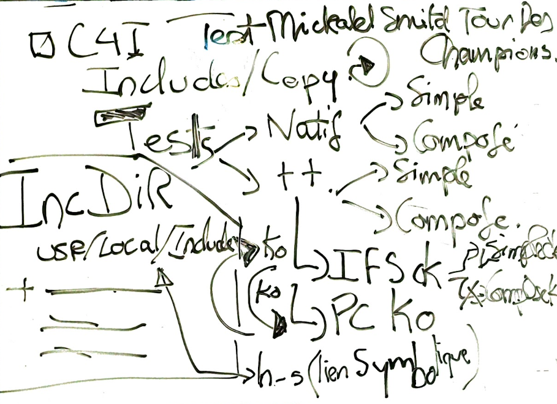
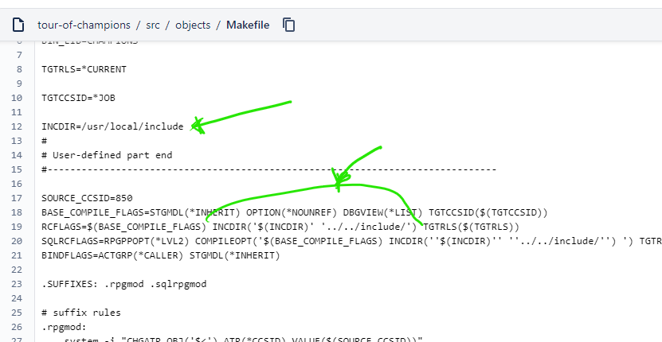
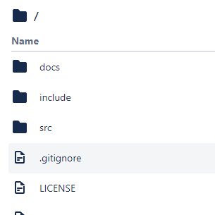

[tourdes champoins](https://bitbucket.org/m1hael/tour-of-champions/src/master/) pour tester les copys 
  

le niveau 2 ne marche pas mais on peut expliciter en direct tous les les niveaux ....
1. en local
? doit exister dans qrpgleref (? un autre nom? ) et /copy 'tag2.rpgle' sans préciser le dossier qrpgleref  ?
1. en natif 
    - /copy '/home/NOVY400/include/CKOOL.rpgle' ==> KO ?  /NOVY4001/QRPGLESRC/CKOOL(member) méme si le copy existe dans qrpgleref
    - /copy qrpglesrc,test.rpgle ==> de la curlib 
1. en IFS
les deux systémes marchent impec    

dans tours des champions au niveau [make](https://bitbucket.org/m1hael/tour-of-champions/src/master/src/objects/Makefile) 
  
  

